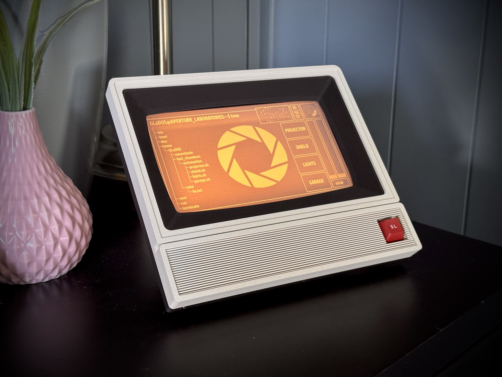
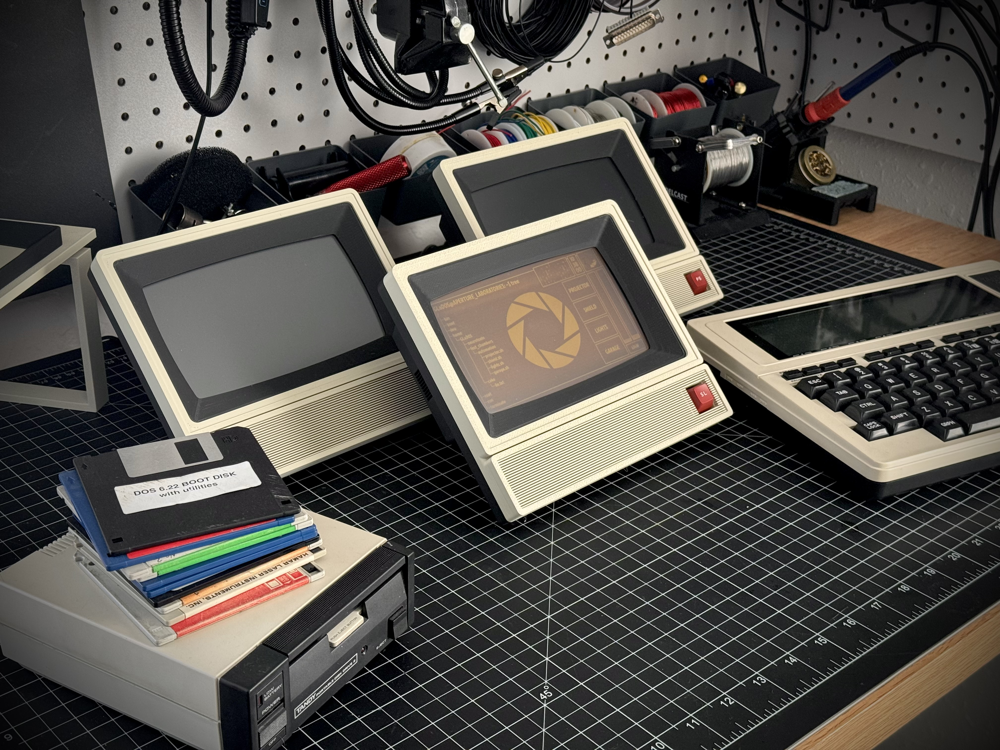
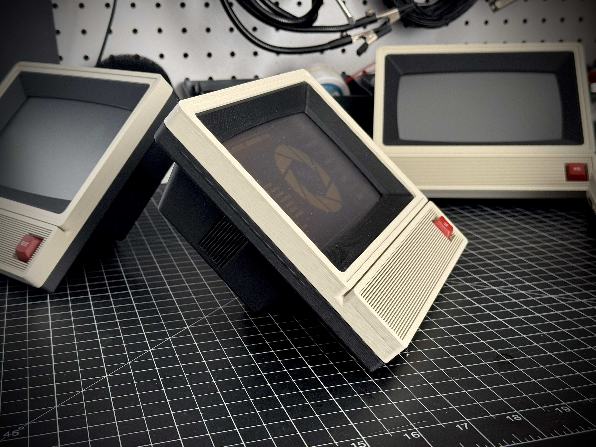
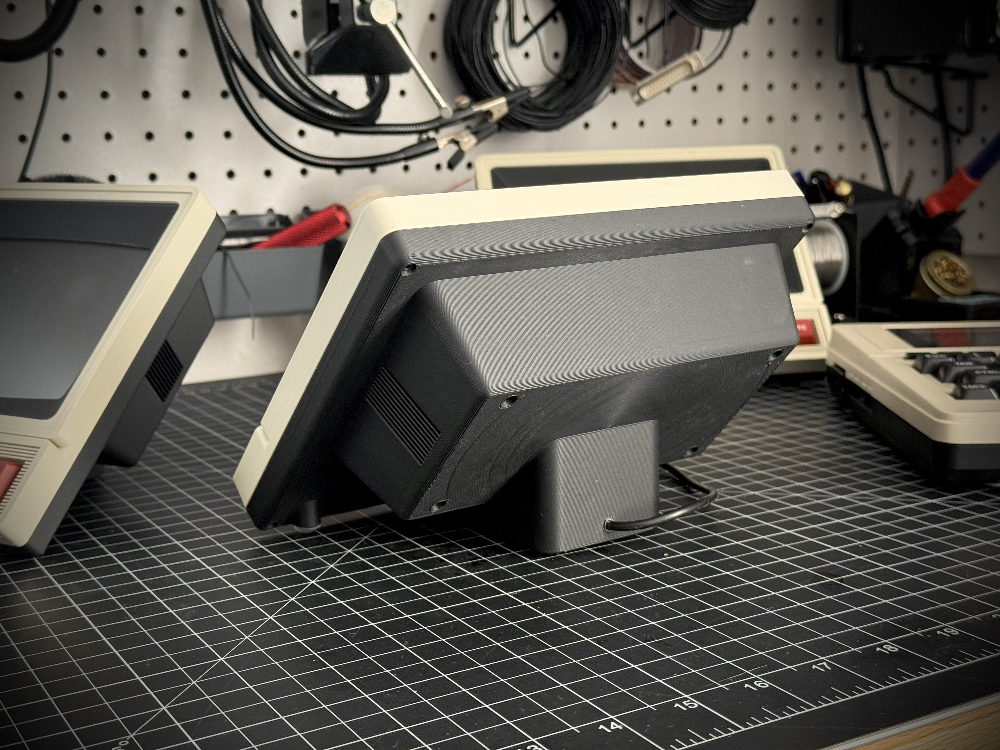
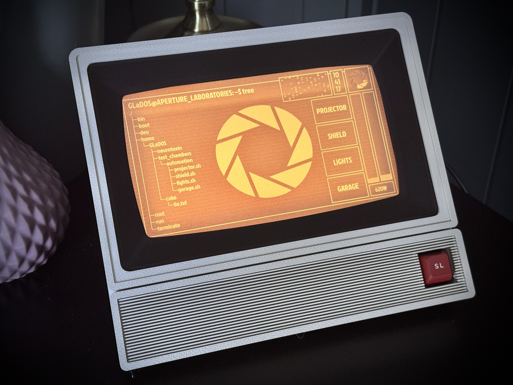

# ESPhome_Display

Hardware:

Waveshare 7” ESP32-S3N8R8 Capacitive Touch Display 1024×600
512KB SRAM and 384KB ROM, with onboard 16MB Flash and 8MB PSRAM
https://www.waveshare.com/esp32-s3-lcd-7b.htm

ESPhome LVGL:

https://esphome.io/components/lvgl/

Notes:

Reference Display.YAML for my example ESPhome integration and upload all "ESPhome Directory Pictures" to the core ESPhome directory. I included blank backgrounds found in Pictures/Blank that you can use to build your own custom Portal display as well. 

Build Instruction:

The full 3D model is attached as Display.step and the printable case files and build instruction can be found here. 

